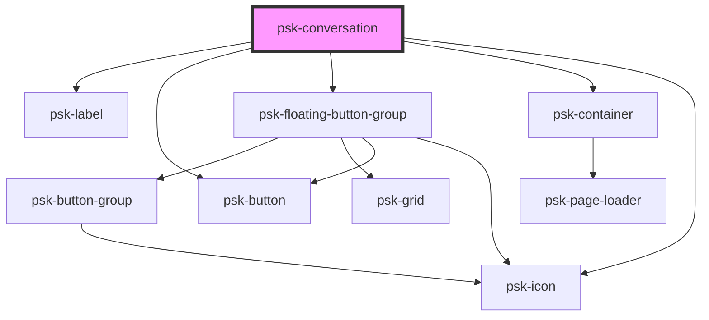

# psk-conversation

<!-- Auto Generated Below -->

## Properties

| Property     | Attribute     | Description | Type     | Default                      |
| ------------ | ------------- | ----------- | -------- | ---------------------------- |
| `configPath` | `config-path` |             | `string` | `"conversation-config.json"` |

## Dependencies

### Depends on

- psk-label
- psk-button
- [psk-floating-button-group](../psk-floating-button-group)
- psk-container
- psk-icon

### Graph

----------------------------------------------

*Built with [StencilJS](https://stenciljs.com/)*
