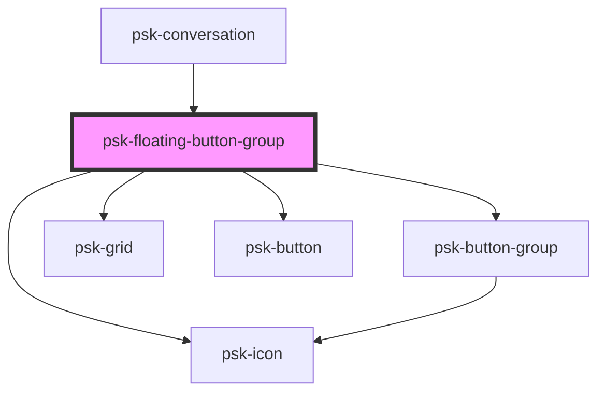

# psk-floating-button-group

<!-- Auto Generated Below -->

## Properties

| Property   | Attribute  | Description | Type                     | Default |
| ---------- | ---------- | ----------- | ------------------------ | ------- |
| `backdrop` | `backdrop` |             | `boolean`                | `false` |
| `buttons`  | --         |             | `FloatingButtonConfig[]` | `[]`    |
| `opened`   | `opened`   |             | `boolean`                | `false` |

## Dependencies

### Used by

 - [psk-conversation](../psk-conversation)

### Depends on

- psk-button-group
- psk-grid
- psk-button
- psk-icon

### Graph

----------------------------------------------

*Built with [StencilJS](https://stenciljs.com/)*
